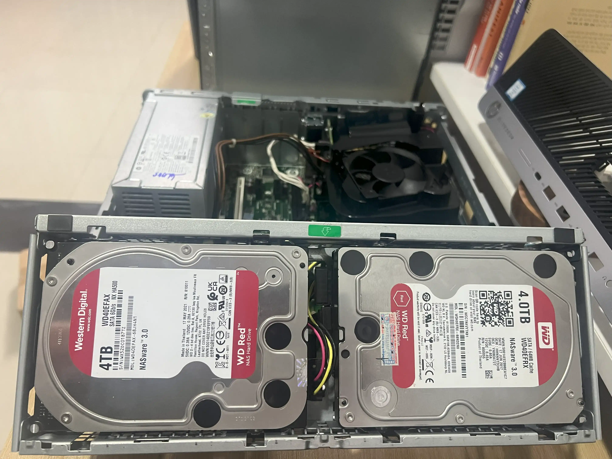
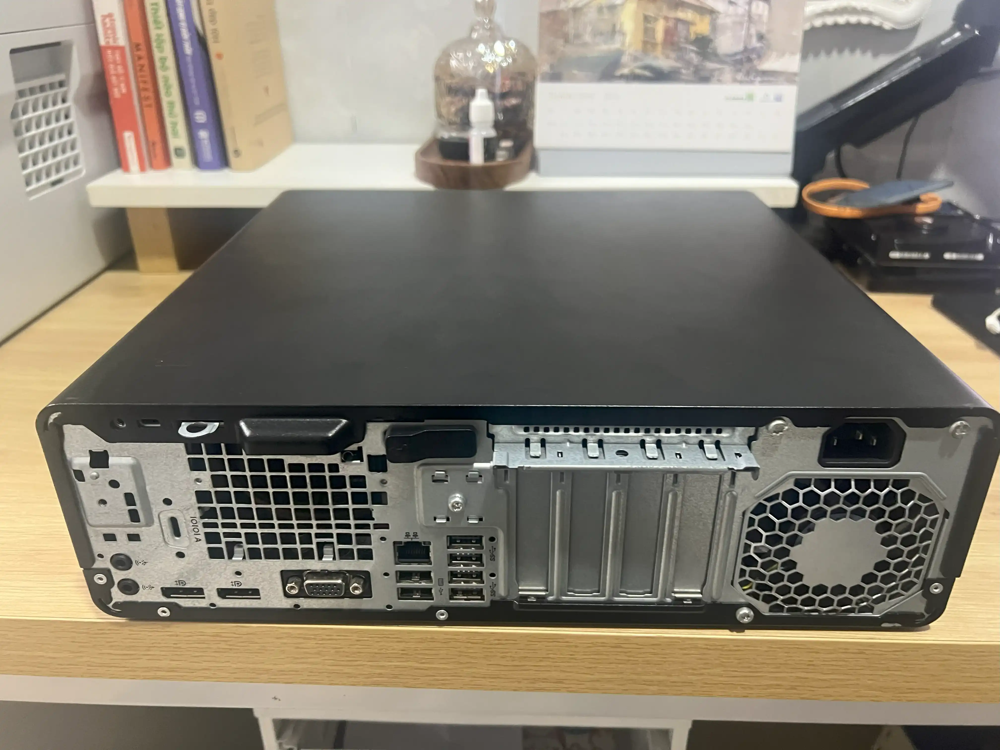

If you’ve followed my blog before (well, my older blogs a few years back), you probably know I’ve shared quite a bit about Debian (L1 Pro) or XPEnology (Fake NAS J1900). For personal reasons, I had to shut down those old blogs, and only now I’m back.  

So I decided to write a new post about my current Homelab/NAS setup: what hardware I’m using, which OS I chose, why I picked it, and the self-hosted services I’m running—as well as what upgrades I plan for the future.  

## 🖥️ Hardware

After several upgrades, I am now using an HP 800 G4 SFF with an i5-8500 (8th Gen, Coffee Lake, 6C/6T), which delivers stable performance and includes an integrated UHD 630 iGPU that can handle 2–3 simultaneous 4K video transcodes.

|       | Name                  | Qty |
|:------|:----------------------|:---:|
| Case  | HP 800 G4 SFF         |  1  |
| CPU   | I5-8500               |  1  |
| RAM   | Hynix 16GB 2666MHz    |  2  |
| SSD   | Samsung 981a 256GB    |  1  |
| HDD   | WD Red 4TB            |  2  |





## 🧑‍💻 unRAID OS

Throughout my Homelab journey, I’ve experimented with different operating systems. Each has its own charm, but for my current Homelab I’m running **unRAID Server**. A few main reasons why:  

- `WEB-UI`: clean, intuitive, easy to manage.  

- `Storage`: lets you combine drives of different sizes into a single array.  
  - Mix 1TB, 2TB, 3TB drives into a 6TB pool,  
  - Add a 3TB drive as Parity for data protection.  

- `Docker`: comes with a visual UI—no need to fiddle with CLI or docker-compose.  





## 📦 Self-hosted Services Running

One thing I really like about unRAID is its prebuilt Docker templates and friendly WebUI, which makes deployment super easy. Here are some of the services I’m running:  

#### 🛡️ Networking & Proxy
- **Nginx Proxy Manager** – reverse proxy + SSL for internal services.  
- **Cloudflare DDNS** – update dynamic IP to Cloudflare.  

#### 📂 File & Storage
- **File Browser** – web UI to manage files directly on the server.  
- **OpenList** – index and publish cloud storage (Google Drive, 115, etc).  

#### 📥 Download & Torrent
- **qBittorrent** – powerful torrent client with web UI.  

#### 📊 Monitoring & Analytics
- **Umami Analytics** – privacy-friendly web analytics, Google Analytics alternative.  
- **Uptime Kuma** – uptime monitoring with alerts when services go down.  
- **Diun (Docker Image Update Notifier)** – notify when containers have updates.  

#### 🎬 Media & Photos
- **Plex Media Server** – store and stream movies/music.  
- **Arr Apps** (Sonarr, Radarr, Lidarr…) – automated media management & downloads.  
- **Immich** – self-hosted Google Photos alternative for managing photos & videos.  

#### 🗄️ Database Backend
- **PostgreSQL** – main database for many apps.  
- **Redis** – caching and session storage.  

#### 🔐 Security & Management
- **Vaultwarden** – self-hosted Bitwarden, password manager.  

#### 💳 Other Utilities
- **Wallos** – track subscriptions (Netflix, Spotify, etc).  
- **Kutt** – self-hosted URL shortener, Bitly alternative.  

## 📌 Conclusion

So that’s my current Homelab—covering the hardware, unRAID OS, and the self-hosted services I use daily. For me, a Homelab is not only about storage and entertainment but also a “personal lab” where I can test technologies, learn, and optimize based on my needs.  

Going forward, I plan to keep upgrading hardware, fine-tuning the setup, and experimenting with more apps. If you’re also interested in Homelab or exploring unRAID, I hope this post gives you some ideas to start—or to expand—your own setup.  

💬 Got questions or want to share your experience? Drop a comment below—we can exchange ideas and maybe learn from each other.
