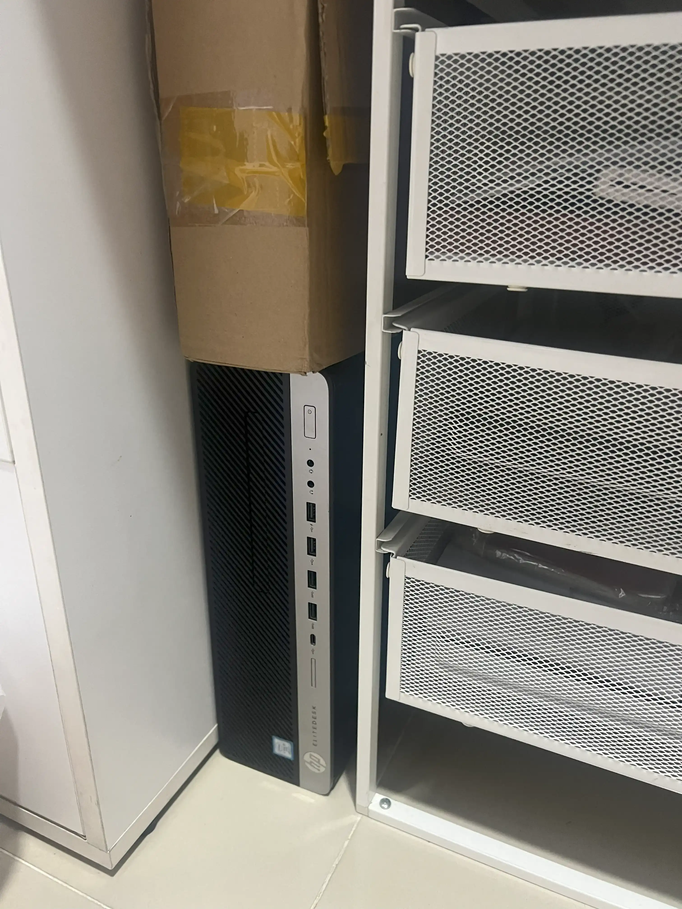
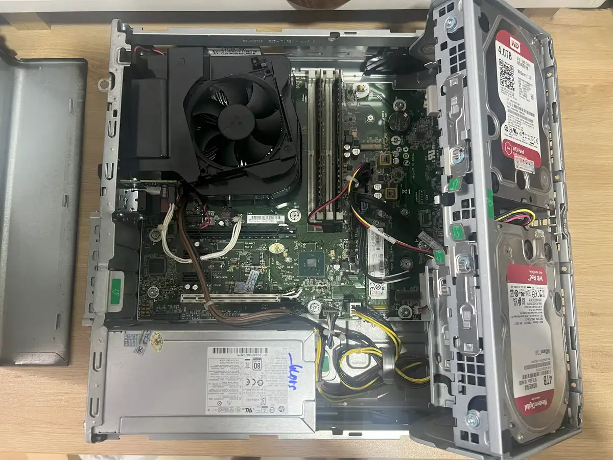
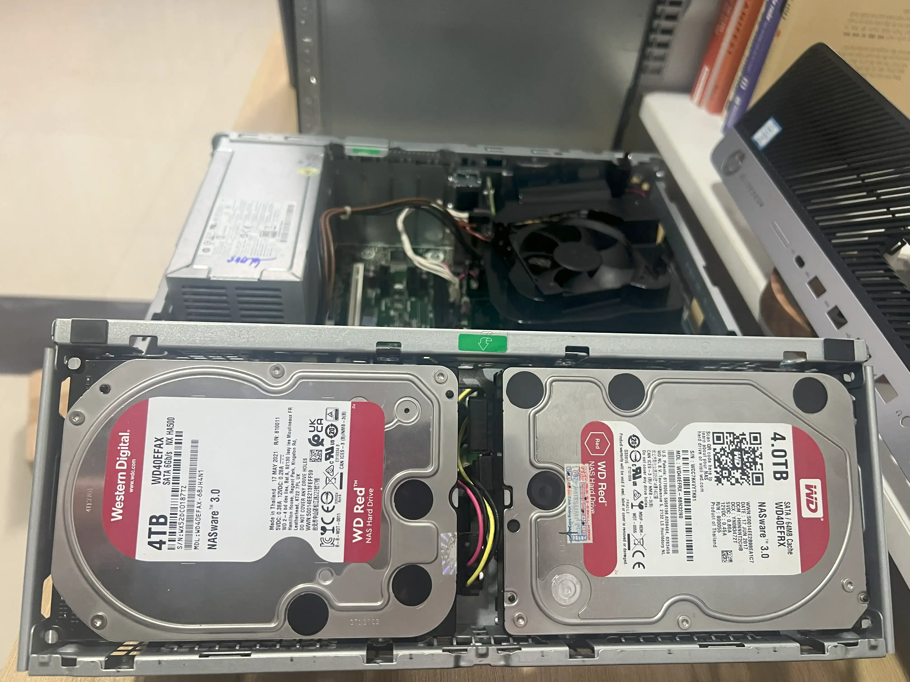
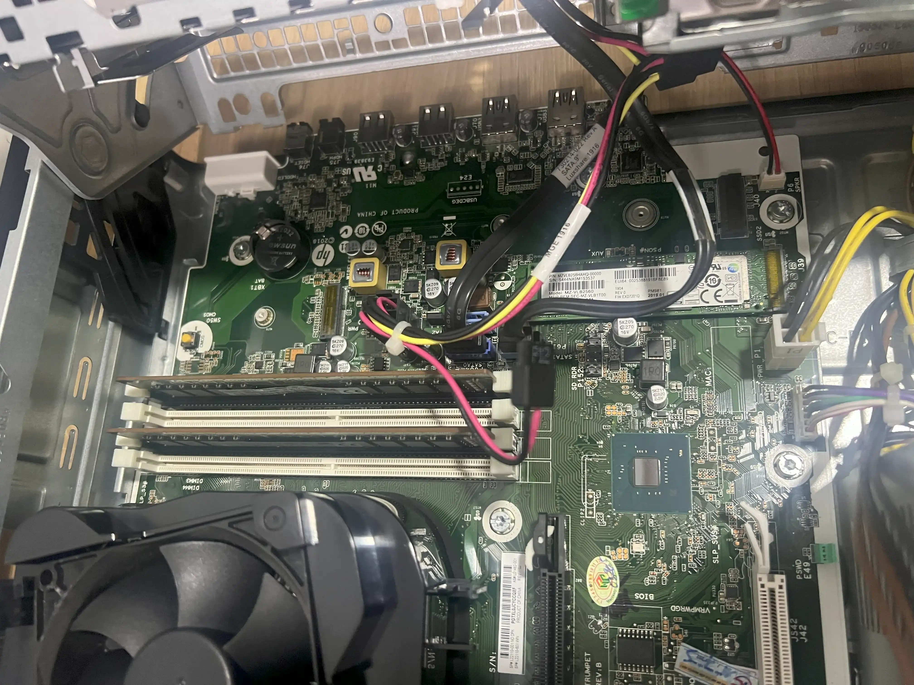
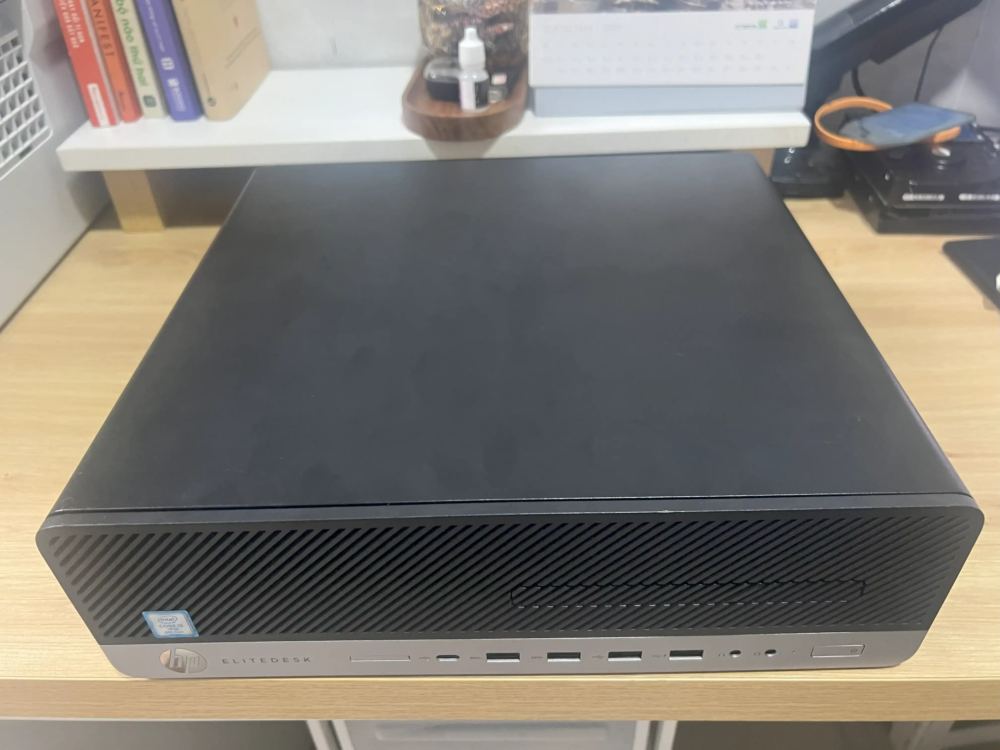
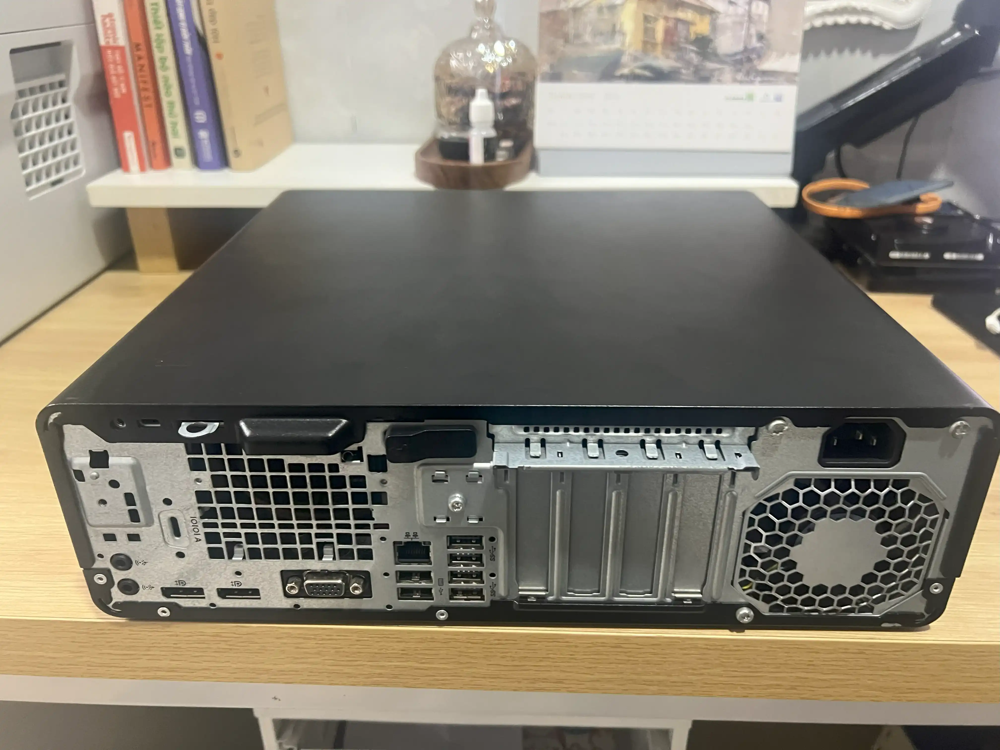
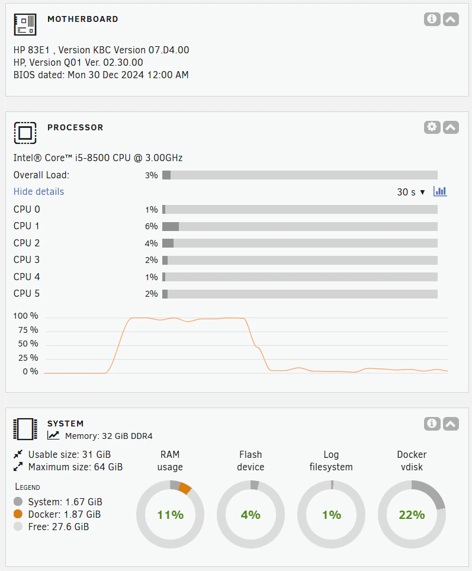
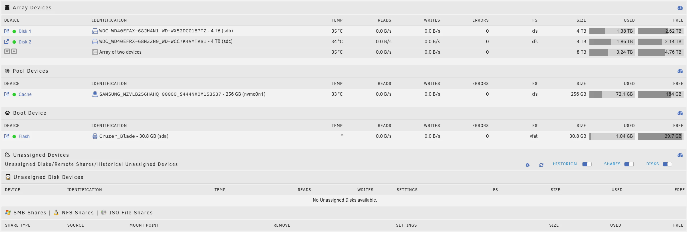
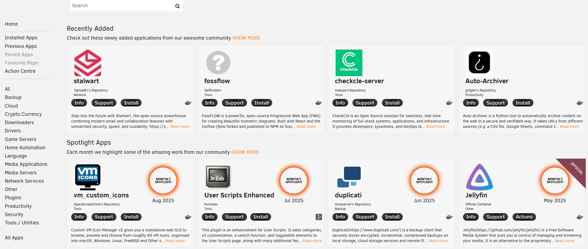
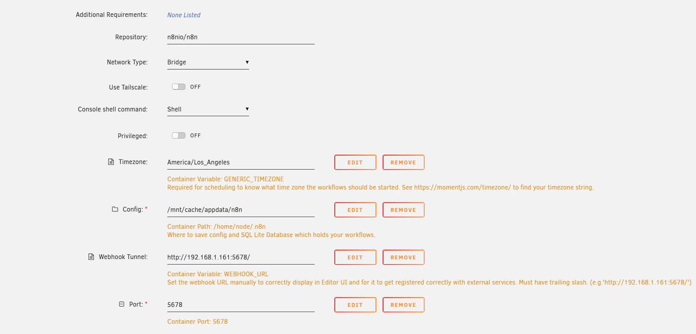

Nếu đã từng theo dõi blog của Hiệp (ờm, blog cũ những năm trước đó), chắc hẳn các bạn đã biết mình đã chia sẻ khá nhiều về Debian (L1 Pro) hoặc là XPEnology (NAS Fake J1900). Cũng vì một số lý do cá nhân mà mình phải đóng các blog cũ đã xây dựng và cho đến bây giờ thì mình mới quay trở lại. 

Thế nên mình cũng viết lại 1 bài blog để nói về Homelab/NAS hiện tại mình đang sử dụng, cấu hình ra sao, sử dụng HĐH gì, lý do tại sao lại chọn như vậy ? Cũng như chia sẻ các dịch vụ self-host mà mình cài đặt cho đến các nâng cấp trong tương lai. 

## 🖥️ Phần cứng

Sau qua những lần nâng cấp thì hiện tại Hiệp đang sử dụng HP 800 G4 SFF Form với I5-8500 (Gen 8, Coffee Lake, 6C/6T) xử lý ổn định, hỗ trợ iGPU UHD630 giúp transcode video 4K khoảng 2-3 luồng rất phù hợp với nhu cầu hiện tại của mình.

|       | Tên                   | Số lượng |
|:------|:----------------------|:--------:|
| Case  | HP 800 G4 SFF         |   1      |
| CPU   | I5-8500               |   1      |
| RAM   | Hynix 16GB 2666MHz    |   2      |
| SSD   | Samsung 981a 256GB    |   1      |
| HDD   | WD Red 4TB            |   2      |





## 🧑‍💻 unRAID OS

Trong suốt hành trình trải nghiệm setup homelab của mình, mình đã thử nghiệm qua nhiều hệ điều hành (OS) khác nhau. Mỗi cái đều có cái thú riêng, nhưng đối với Homelab hiện tại thì mình đang sử dụng unRAID Server. Có một số lý do cơ bản mình chọn nó là vì

- `WEB-UI`: trực quan, thân thiện, dễ quản lý

- `Storage`: Cho phép dùng nhiều ổ cứng dung lượng khác nhau để tạo một mảng lưu trữ duy nhất. 
    - Kết hợp ổ 1TB, 2TB, 3TB để có tổng dung lượng 6TB, 
    - Backup dữ liệu: Gán ổ 3TB vào Parity

- `Docker`: giao diện trực quan, không phải kiểm soát bằng Cli hay Docker-compose.





## 📦 Các dịch vụ Self-hosted đang chạy
Một trong những lý do khiến mình thích unRAID chính là kho ứng dụng Docker đã thiết lập sẵn Template với giao diện WebUI thân thiện nên rất dễ triển khai. Dưới đây là 1 số dịch vụ mà mình đang triển khai.

#### 🛡️ Networking & Proxy
- **Nginx Proxy Manager** – reverse proxy, SSL cho các dịch vụ nội bộ.  
- **Cloudflare DDNS** – cập nhật IP động về Cloudflare.  

#### 📂 File & Storage
- **File Browser** – giao diện web quản lý file trực tiếp trên server.  
- **OpenList** – index và public cloud storage (Google Drive, 115, v.v).  

#### 📥 Download & Torrent
- **qBittorrent** – client torrent mạnh mẽ, có web UI.  

#### 📊 Giám sát & Phân tích
- **Umami Analytics** – phân tích truy cập website, thay thế Google Analytics.  
- **Uptime Kuma** – monitor uptime dịch vụ, gửi cảnh báo khi down.  
- **Diun (Docker Image Update Notifier)** – thông báo khi có bản update mới cho container.  

#### 🎬 Media & Photos
- **Plex Media Server** – lưu trữ và stream phim/nhạc.  
- **Arr Apps** (Sonarr, Radarr, Lidarr…) – tự động quản lý, tải và sắp xếp media.  
- **Immich** – self-hosted Google Photos thay thế, quản lý hình ảnh & video.  

#### 🗄️ Database Backend
- **PostgreSQL** – cơ sở dữ liệu chính cho nhiều app.  
- **Redis** – cache và session cho ứng dụng.  

#### 🔐 Bảo mật & Quản lý
- **Vaultwarden** – self-hosted Bitwarden, quản lý mật khẩu.  

#### 💳 Tiện ích khác
- **Wallos** – quản lý subscription (Netflix, Spotify, v.v).  
- **Kutt** – rút gọn URL, thay thế Bitly.  

## 📌 Kết luận

Vậy là mình đã điểm lại toàn bộ Homelab hiện tại – từ phần cứng, hệ điều hành unRAID cho đến các dịch vụ self-hosted đang chạy hằng ngày. Với mình, Homelab không chỉ là nơi lưu trữ dữ liệu, giải trí mà còn là một “phòng thí nghiệm” nhỏ để thử nghiệm công nghệ, học hỏi và tối ưu dần theo nhu cầu.

Trong tương lai, mình sẽ tiếp tục nâng cấp phần cứng, tối ưu cấu hình cũng như thử nghiệm thêm nhiều ứng dụng mới. Nếu bạn cũng quan tâm đến Homelab hoặc đang tìm hiểu về unRAID, hy vọng bài viết này sẽ giúp bạn có thêm ý tưởng để bắt đầu hoặc mở rộng hệ thống của riêng mình.

💬 Nếu bạn có thắc mắc hoặc muốn chia sẻ kinh nghiệm, hãy để lại bình luận nhé. Chúng ta có thể trao đổi thêm và biết đâu học hỏi lẫn nhau.