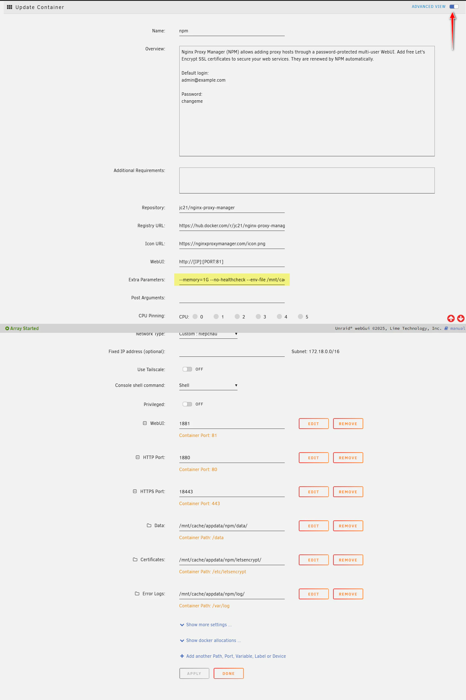
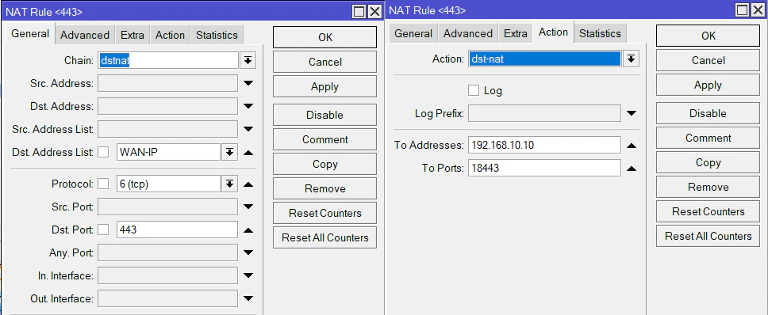
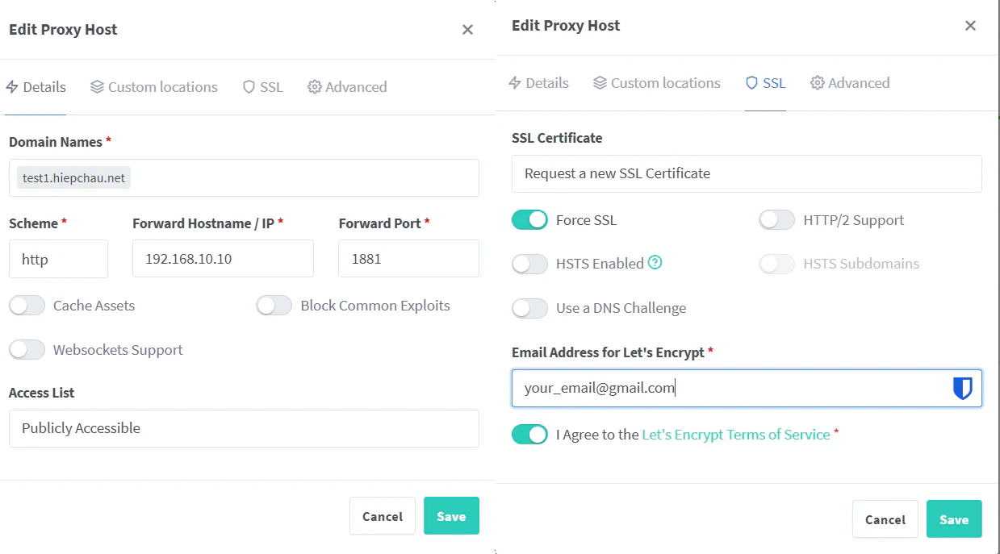
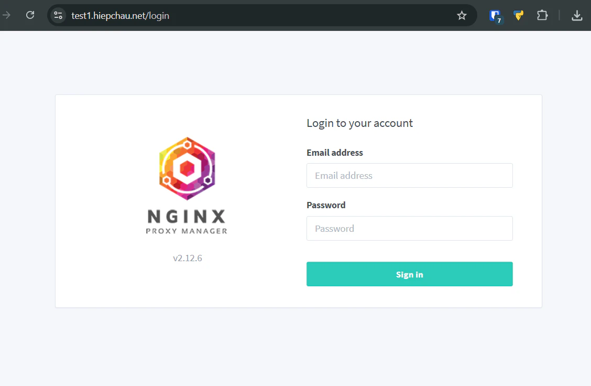

Nginx Proxy Manager (NPM) is a tool for managing and configuring Nginx reverse proxy through a user-friendly web interface. It supports multiple domains, HTTPS/SSL certificates, and automatic Let’s Encrypt integration. This allows you to configure Reverse Proxy, SSL, Redirects, and many other features without having to manually edit Nginx configuration files.

This article details the process of installing NPM on unRAID with PostgreSQL instead of using the default SQLite provided by NPM.

## 🌱 Requirements
1. [Cloudflare DDNS for unRAID Server](https://hiepchau.net/posts/cloudflare-ddns/)
2. [Install PostgreSQL](https://hiepchau.net/posts/unraid-install-postgresql/) 

## 🗄️ Create a Database for NPM

See the database creation guide in: [Install PostgreSQL](https://hiepchau.net/posts/unraid-install-postgresql/#login-v%C3%A0-kh%E1%BB%9Fi-t%E1%BA%A1o-database)

```bash
# psql -d postgres -U postgres -W
Password: 
psql (16.9 (Debian 16.9-1.pgdg120+1))
Type "help" for help.

postgres=# create database npm;
CREATE DATABASE
postgres=# create user npm with encrypted password 'npmpd';
CREATE ROLE
postgres=# grant connect on database npm to npm;
GRANT
postgres=# alter database npm owner to npm;
ALTER DATABASE
```

So we have created a database for NPM with the following information:
- DB Name: npm
- DB User: npm
- DB Pass: npmpd

## 📄 Create .env to Store Database Information

I don’t want the database information to appear in the unRAID Container Web UI, so I put it into a `.env` file.

```bash
hiepchau@unRAID: mkdir -p /mnt/user/appdata/npm 
hiepchau@unRAID: nano -p /mnt/user/appdata/npm/.env
```

```yaml {filename=".env"}
DB_POSTGRES_HOST=localhost # Replace with NAS IP address
DB_POSTGRES_PORT=5432
DB_POSTGRES_NAME=npm
DB_POSTGRES_USER=npm
DB_POSTGRES_PASSWORD=npmpd
```

## 🐧 Install NPM on unRAID

1. Log in to the unRAID Dashboard
2. Go to Apps
3. Search `Nginx Proxy Manager`
4. Install → OK → Switch to Advanced View
5. Adjust Container configuration
6. Apply → The system will automatically pull data and deploy the app

>[!IMPORTANT]
>1. `.env` file 
>
>       ```xml
>       Extra Parameters: --env-file /mnt/user/appdata/npm/.env
>       ```
>
>2. Port 
>Since the unRAID Dashboard already uses port 80 for WebUI, if the container also uses this port, the application will not start. To resolve this conflict, I reassigned all ports by prefixing them with 18.
>
>       1. Web UI Port:  `81 → 1881` 
>
>       2. HTTP Port:    `80 → 1880`
>
>       3. HTTPS Port:   `443 → 18443`



## 🔑 Open Ports 443/80 for NPM

For operation, NPM requires ports 80 (HTTP) and 443 (HTTPS). These are the standard ports used to handle external web requests, allowing NPM to act as a reverse proxy.

- Port 80 (HTTP): NPM uses this port to receive normal web requests.

- Port 443 (HTTPS): This is the most important port, as NPM uses it to:

    - Receive secure requests.

    - Automatically issue and renew free SSL/TLS certificates from Let’s Encrypt for domains.

1. Log in to Mikrotik via Winbox
2. IP → Firewall → NAT → Add New NAT Rule
```yaml
Chain: dstnat
Dst. Address List: WAN-IP   # WAN IP list
Protocol: 6(tcp)
Dst. Port: 443

Action: dst-nat
To Address: 192.168.10.10   # NAS IP
To Ports: 18443             # Container port 18443
```



> [!NOTE]
> Do the same to open Port 80

## 🌐 Access the Management Interface

Open a web browser and go to
```html
https://<ip_nas>:1881
```

Default account:

- Email: admin@example.com
- Password: changeme

⚠️ Log in and change the password immediately after the first login.

## 🔀 Configure Reverse Proxy

After logging in and changing the password, we proceed to create a Reverse Proxy. Below, I will create a Reverse Proxy for the NPM service.

1. NPM Dashboard → Proxy Hosts → Add Proxy Host.
2. In the Details tab
    1. Domain name: `test1.hiepchau.net`
    2. Schema: `HTTP`
    3. Forward Hostname / IP: `192.168.10.10`
    4. Forward Port: `1881`
    5. 🗸 Block Common Exploits
3. In the SSL tab
    1. SSL Certificate: `Request a new SSL Certificate`
    2. 🗸 Force SSL
    3. Email Address: your_email@gmail.com
    4. 🗸 Agree terms
4. Click Save



After successful creation, you can access the NPM Dashboard via the domain https://test1.hiepchau.net.



## ✅ Conclusion

Through the detailed installation process presented, it is clear that deploying Nginx Proxy Manager on unRAID is not only an effective technical solution but also brings many practical benefits.

With NPM, managing web services is greatly simplified, while enhancing security by automating the issuance and renewal of SSL/TLS certificates. This ensures your system runs stably, securely, and is easily accessible via domains, replacing complex IP addresses and ports, thereby improving user experience.
