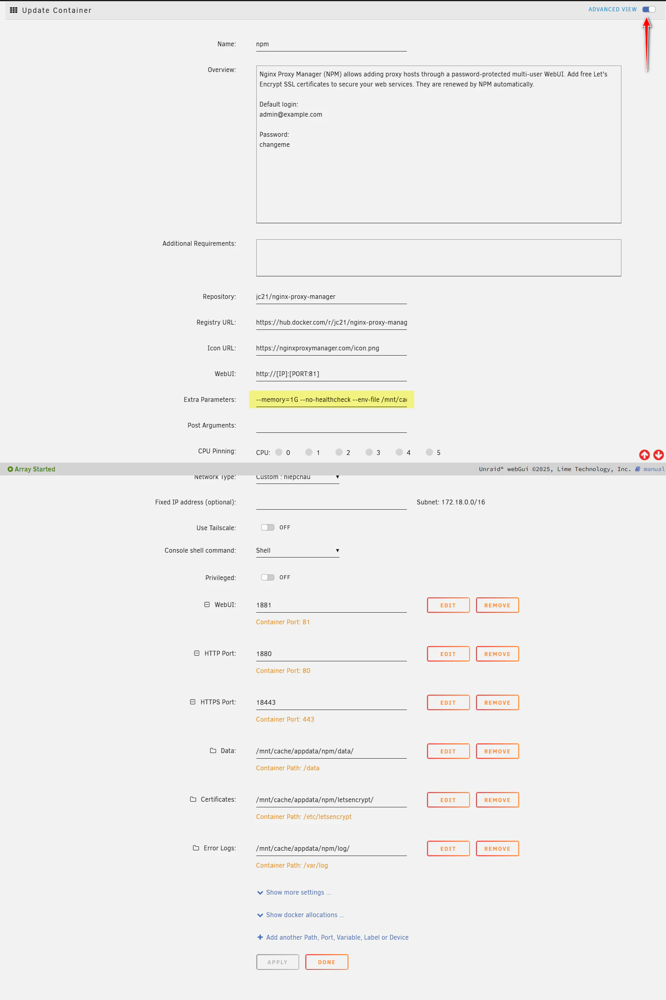
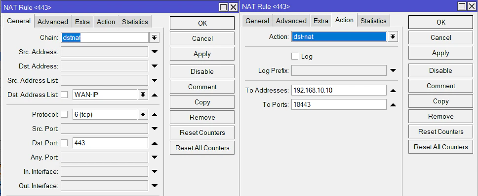
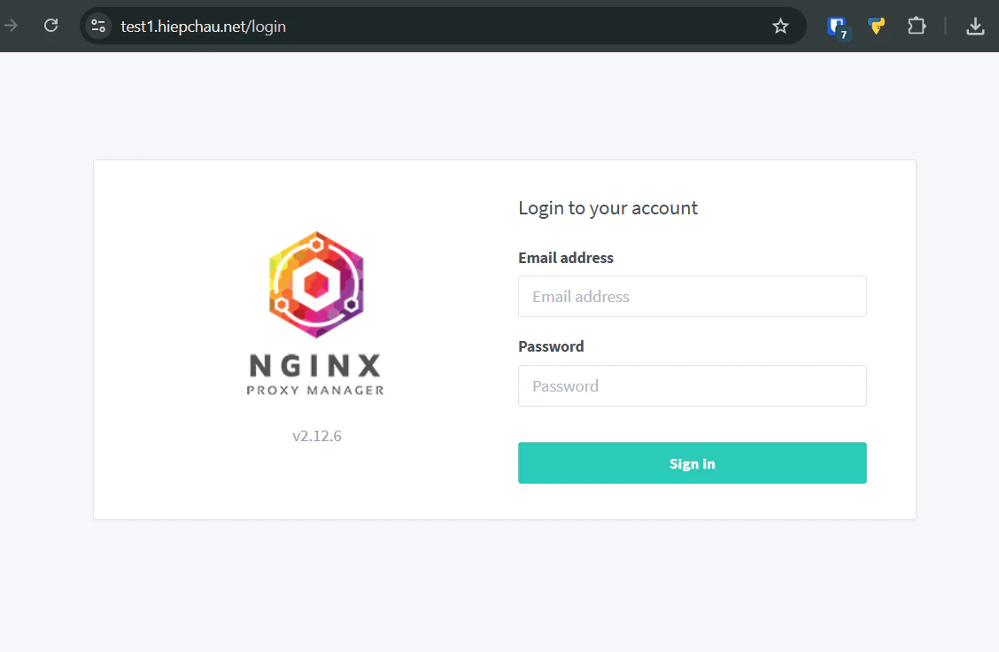

Nginx Proxy Manager (NPM) là một công cụ quản lý và cấu hình proxy ngược Nginx thông qua giao diện web thân thiện với người dùng. Công cụ này hỗ trợ nhiều tên miền, chứng chỉ HTTPS/SSL và tích hợp Let’s Encrypt tự động. giúp cấu hình Reverse Proxy, SSL, chuyển hướng (Redirect) và nhiều tính năng khác mà không cần chỉnh sửa file cấu hình Nginx thủ công.

Bài viết này mình sẽ chi tiết lại quá trình mà bản thân mình cài đặt NPM trên unRAID với PostgreSQL thay vì sử dụng SQLite mặc định mà NPM cung cấp.

## 🌱 Yêu Cầu
1. [Cloudflare DDNS cho unRAID Server](https://hiepchau.net/posts/cloudflare-ddns/)
2. [Cài đặt PostgreSQL](https://hiepchau.net/posts/unraid-install-postgresql/) 

## 🗄️ Tạo database cho NPM

Xem hướng dẫn tạo database tại bài viết: [Cài đặt PostgreSQL](https://hiepchau.net/posts/unraid-install-postgresql/#login-v%C3%A0-kh%E1%BB%9Fi-t%E1%BA%A1o-database)

```bash
# psql -d postgres -U postgres -W
Password: 
psql (16.9 (Debian 16.9-1.pgdg120+1))
Type "help" for help.

postgres=# create database npm;
CREATE DATABASE
postgres=# create user npm with encrypted password 'npmpd';
CREATE ROLE
postgres=# grant connect on database npm to npm;
GRANT
postgres=# alter database npm owner to npm;
ALTER DATABASE
```

Như vậy mình đã tạo xong database cho NPM với các thông tin: 
- DB Name: npm
- DB User: npm
- DB Pass: npmpd

## 📄 Tạo .env để chứa thông tin Database

Mình không muốn các thông tin về database xuất hiện trong Container Web UI của unRAID nên mình sẽ đưa nó vào `.env` file

```bash
hiepchau@unRAID: mkdir -p /mnt/user/appdata/npm 
hiepchau@unRAID: nano -p /mnt/user/appdata/npm/.env
```

```yaml {filename=".env"}
DB_POSTGRES_HOST=localhost # Thay bằng địa chỉ IP của NAS
DB_POSTGRES_PORT=5432
DB_POSTGRES_NAME=npm
DB_POSTGRES_USER=npm
DB_POSTGRES_PASSWORD=npmpd
```

## 🐧 Cài đặt NPM trên unRAID

1. Đăng nhập vào unRAID Dashboard
2. Truy cập vào Apps
3. Tìm `Nginx Proxy Manager` trên thanh tìm kiếm
4. Install → OK → Chuyển Advanced View
5. Chỉnh cấu hình Container
6. Apply → Hệ thống tự động pull data và deploy app

>[!IMPORTANT]
>1. `.env` file 
>
>       ```xml
>       Extra Parameters: --env-file /mnt/user/appdata/npm/.env
>       ```
>
>2. Vì unRAID Dashboard đã sử dụng cổng 80 cho WebUI, nếu cấu hình container cũng dùng cổng này, ứng dụng sẽ không thể khởi động. Để giải quyết vấn đề xung đột cổng, tôi đã thiết lập lại toàn bộ các cổng bằng cách thêm tiền tố 18 vào trước.
>
>       1. Web UI Port:  `81 → 1881` 
>
>       2. HTTP Port:    `80 → 1880`
>
>       3. HTTPs Port:   `443 → 18443`



## 🔑 Mở port 443/80 cho NPM

Để hoạt động, NPM yêu cầu mở cổng 80 (HTTP) và 443 (HTTPs). Đây là hai cổng chuẩn được dùng để xử lý các yêu cầu web từ bên ngoài, cho phép NPM làm nhiệm vụ reverse proxy.

- Cổng 80 (HTTP): NPM sử dụng cổng này để nhận các yêu cầu truy cập web thông thường.

- Cổng 443 (HTTPs): Đây là cổng quan trọng nhất, vì NPM dùng nó để:

    - Nhận các yêu cầu bảo mật.

    - Tự động cấp và gia hạn chứng chỉ SSL/TLS miễn phí từ Let's Encrypt cho các domain.

1. Đăng nhập vào Mikrotik thông qua Winbox
2. IP → Firewall → NAT → Add New NAT Rule
```yaml
Chain: dstnat
Dst. Address List: WAN-IP   # Danh sách WAN IP
Protocol: 6(tcp)
Dst. Port: 443

Action: dst-nat
To Address: 192.168.10.10   # IP của NAS
To Ports: 18443             # Port 18443 của container
```



> [!NOTE]
> Làm tương tự để mở Port 80

## 🌐 Truy cập giao diện quản lý

Mở trình duyệt web và truy cập
```html
https://<ip_nas>:1881
```

Tài khoản mặc định:

- Email: admin@example.com
- Password: changeme

⚠️ Đăng nhập và đổi mật khẩu ngay sau lần đăng nhập đầu tiên.

## 🔀 Cấu Hình Reverse Proxy

Sau khi đăng nhập và đổi mật khẩu xong. Chúng ta tiến hành tạo Reverse Proxy. Dưới đây Hiệp sẽ tạo 1 Reverse Proxy cho dịch vụ NPM.

1. NPM Dashboard → Proxy Hosts → Add Proxy Host.
2. Tại tab Details
    1. Domain name: `test1.hiepchau.net`
    2. Schema: `HTTP`
    3. Foward Hostname / IP: `192.168.10.10`
    4. Foward Port: `1881`
    5. 🗸 Block Common Exploits
3. Tại tab SSL
    1. SSL Certificate: `Request a new SSL Certificate`
    2. 🗸 Force SSL
    3. Email Address: your_email@gmail.com
    4. 🗸 Agree terms
4. Bấm Save


Sau khi tạo thành công thì bạn đã có thể truy cập vào NPM Dasboard bằng domain https://test1.hiepchau.net.



## ✅ Kết Luận

Qua quá trình cài đặt chi tiết đã được trình bày, ta thấy rằng việc triển khai Nginx Proxy Manager trên unRAID không chỉ là một giải pháp kỹ thuật hiệu quả mà còn mang lại nhiều lợi ích thiết thực. 

Với NPM, việc quản lý các dịch vụ web được đơn giản hóa tối đa, đồng thời tăng cường lớp bảo mật bằng cách tự động hóa quy trình cấp và gia hạn chứng chỉ SSL/TLS. Điều này giúp hệ thống của bạn hoạt động ổn định, an toàn và dễ dàng truy cập thông qua các tên miền, thay thế cho việc sử dụng địa chỉ IP và các cổng phức tạp, nâng cao trải nghiệm sử dụng.