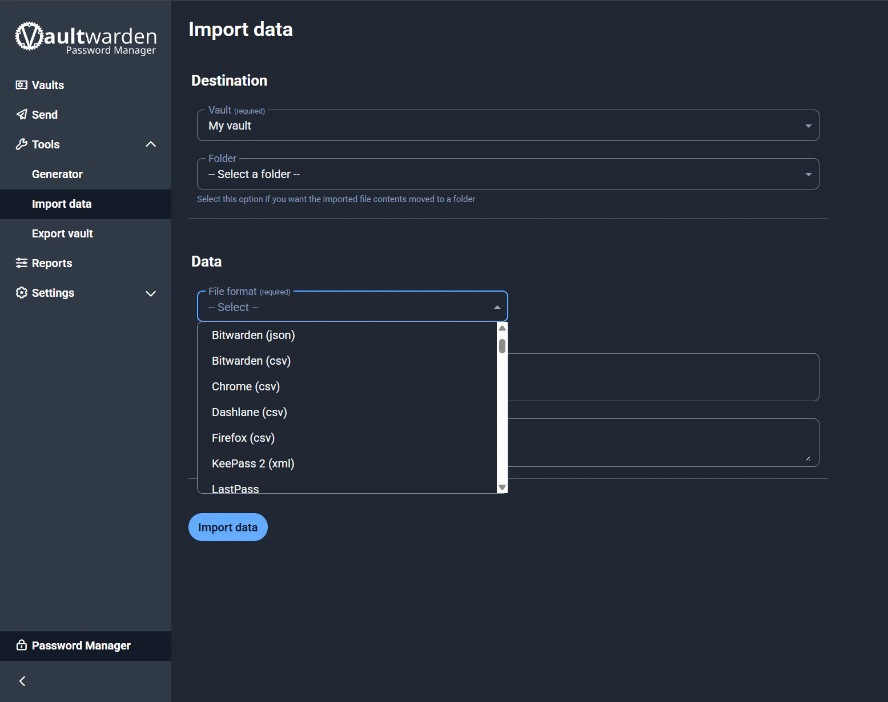

Vaultwarden is a free, open-source software written in Rust, serving as a lightweight alternative server for Bitwarden. Essentially, it provides all the core features of Bitwarden—a popular password manager—while being lighter and easier to self-host on your personal server.

This article details my process of installing Vaultwarden on unRAID with PostgreSQL.

## 🌱 Requirements
1. [Install PostgreSQL](https://hiepchau.net/posts/unraid-install-postgresql/) 
2. [Install NPM](https://hiepchau.net/posts/unraid-install-nginx-proxy-manager/)

## 🗄️ Create Database for Vaultwarden

See the database creation guide here: [Install PostgreSQL](https://hiepchau.net/posts/unraid-install-postgresql/#login-v%C3%A0-kh%E1%BB%9Fi-t%E1%BA%A1o-database)

```bash
# psql -d postgres -U postgres -W
Password: 
psql (16.9 (Debian 16.9-1.pgdg120+1))
Type "help" for help.

postgres=# create database vaultwarden;
CREATE DATABASE
postgres=# create user vaultwarden with encrypted password 'vaultwardenpd';
CREATE ROLE
postgres=# grant connect on database vaultwarden to vaultwarden;
GRANT
postgres=# alter database vaultwarden owner to vaultwarden;
ALTER DATABASE
```

At this point, I have created the database for Vaultwarden with the following details: 
- DB Name: vaultwarden
- DB User: vaultwarden
- DB Pass: vaultwardenpd

## 📄 Create .env to Store Database Information

I don’t want database information to appear in the unRAID Container Web UI, so I put it into a `.env` file.

```bash
hiepchau@unRAID: mkdir -p /mnt/user/appdata/vaultwarden 
hiepchau@unRAID: nano -p /mnt/user/appdata/vaultwarden/.env
```

```yaml {filename=".env"}
DB_POSTGRES_HOST=localhost # Replace with the NAS IP address
DB_POSTGRES_PORT=5432
DB_POSTGRES_NAME=vaultwarden
DB_POSTGRES_USER=vaultwarden
DB_POSTGRES_PASSWORD=vaultwardenpd
```

## 🐧 Install NPM on unRAID

1. Log in to the unRAID Dashboard
2. Go to Apps
3. Search for `vaultwarden`
4. Install → OK → Switch to Advanced View
5. Adjust the Container configuration
6. Apply → The system will automatically pull data and deploy the app

>[!IMPORTANT]
>```xml
>Extra Parameters: --env-file /mnt/user/appdata/vaultwarden/.env
>```


## 🌐 Configure Domain
1. Log in to the NPM Dashboard
2. Proxy Hosts → Add Proxy Host
3. Fill in the details as shown in the image and save


## 👤 Create Admin User
1. Access the domain you just created.
2. Create account → create admin account


## 📥 Import Existing Data

1. Log in to Vaultwarden with the admin account created above
2. Tools → Import data
3. Choose file format and Import



## ✅ Conclusion

If you don’t want to entrust your personal information to third-party services like Bitwarden, 1Password, or LastPass, deploying Vaultwarden on unRAID is a practical choice. You maintain full control of your data while ensuring higher security. Moreover, with PostgreSQL and NPM, the system remains flexible, easy to scale, and sustainable within your homelab.
