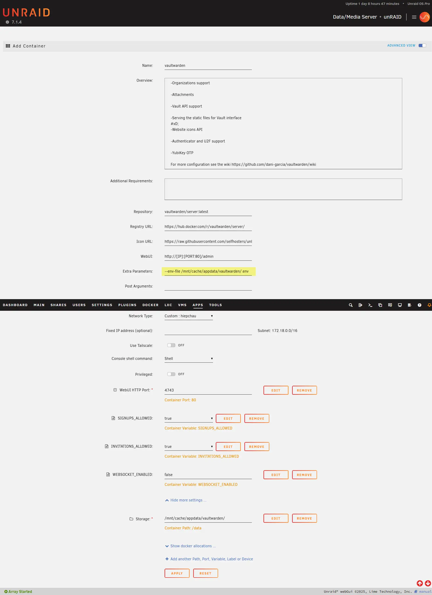
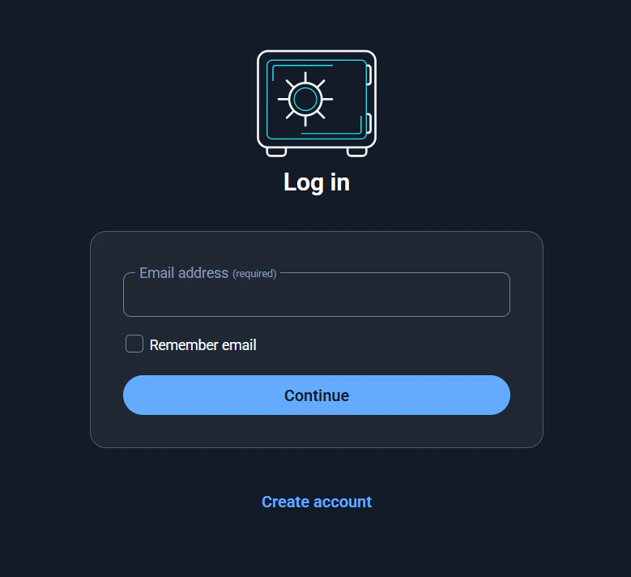
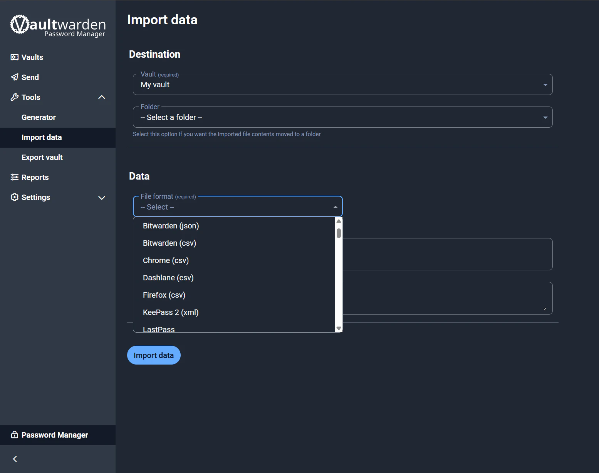

Vaultwarden là một phần mềm mã nguồn mở miễn phí, được viết bằng ngôn ngữ lập trình Rust, hoạt động như một máy chủ thay thế cho Bitwarden. Về cơ bản, nó cung cấp tất cả các tính năng cốt lõi của Bitwarden, một trình quản lý mật khẩu phổ biến, nhưng lại nhẹ hơn và dễ dàng tự lưu trữ trên máy chủ cá nhân (self-hosted).

Bài viết này mình sẽ chi tiết lại quá trình mà bản thân mình cài đặt Vaultwarden trên unRAID với PostgreSQL.

## 🌱 Yêu Cầu
1. [Cài đặt PostgreSQL](https://hiepchau.net/posts/unraid-install-postgresql/) 
2. [Cài đặt NPM](https://hiepchau.net/posts/unraid-install-nginx-proxy-manager/)

## 🗄️ Tạo database cho Vaultwarden

Xem hướng dẫn tạo database tại bài viết: [Cài đặt PostgreSQL](https://hiepchau.net/posts/unraid-install-postgresql/#login-v%C3%A0-kh%E1%BB%9Fi-t%E1%BA%A1o-database)

```bash
# psql -d postgres -U postgres -W
Password: 
psql (16.9 (Debian 16.9-1.pgdg120+1))
Type "help" for help.

postgres=# create database vaultwarden;
CREATE DATABASE
postgres=# create user vaultwarden with encrypted password 'vaultwardenpd';
CREATE ROLE
postgres=# grant connect on database vaultwarden to vaultwarden;
GRANT
postgres=# alter database vaultwarden owner to vaultwarden;
ALTER DATABASE
```

Như vậy mình đã tạo xong database cho Vaultwarden với các thông tin: 
- DB Name: vaultwarden
- DB User: vaultwarden
- DB Pass: vaultwardenpd

## 📄 Tạo .env để chứa thông tin Database

Mình không muốn các thông tin về database xuất hiện trong Container Web UI của unRAID nên mình sẽ đưa nó vào `.env` file

```bash
hiepchau@unRAID: mkdir -p /mnt/user/appdata/vaultwarden 
hiepchau@unRAID: nano -p /mnt/user/appdata/vaultwarden/.env
```

```yaml {filename=".env"}
DB_POSTGRES_HOST=localhost # Thay bằng địa chỉ IP của NAS
DB_POSTGRES_PORT=5432
DB_POSTGRES_NAME=vaultwarden
DB_POSTGRES_USER=vaultwarden
DB_POSTGRES_PASSWORD=vaultwardenpd
```

## 🐧 Cài đặt NPM trên unRAID

1. Đăng nhập vào unRAID Dashboard
2. Truy cập vào Apps
3. Tìm `vaultwarden` trên thanh tìm kiếm
4. Install → OK → Chuyển Advanced View
5. Chỉnh cấu hình Container
6. Apply → Hệ thống tự động pull data và deploy app

>[!IMPORTANT]
>```xml
>Extra Parameters: --env-file /mnt/user/appdata/vaultwarden/.env
>```



## 🌐 Cấu hình tên miền
1. Đăng nhập vào NPM Dashboard
2. Proxy Hosts → Add Proxy Host
3. Điền thông tin như hình và lưu lại


## 👤 Tạo admin user
1. Truy cập domain vừa tạo ở trên. 
2. Create account → tạo account admin



## 📥 Import data có sẵn

1. Đăng nhập Vaultwarden bằng tài khoản Admin ở trên vừa tạo 
2. Tools → Import data
3. Chọn file format và Import 



## ✅ Kết luận

Nếu bạn không muốn giao phó thông tin cá nhân cho bên thứ ba như Bitwarden, 1Password hay LastPass, thì việc tự triển khai Vaultwarden trên unRAID là lựa chọn hợp lý. Bạn vừa chủ động kiểm soát dữ liệu, vừa đảm bảo tính bảo mật cao hơn. Bên cạnh đó, nhờ sử dụng PostgreSQL và NPM, hệ thống vẫn linh hoạt, dễ dàng mở rộng và duy trì lâu dài trong homelab của bạn.